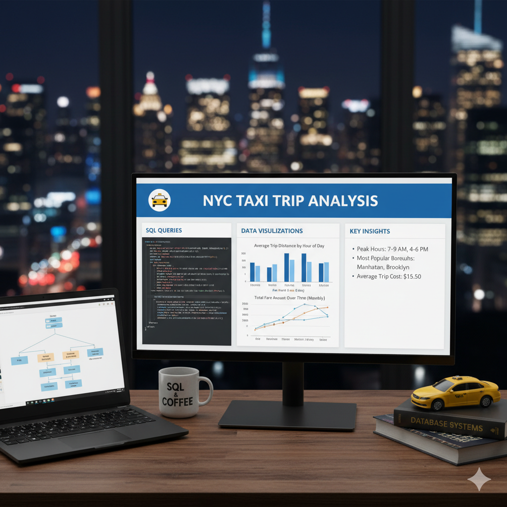

# 🚖 Taxi Trip Data Analysis (SQL Project)

## 📌 Project Overview
This project demonstrates SQL techniques used by analysts to explore, clean, and analyze **NYC taxi trip data**.  
It focuses on **revenue analysis, customer behavior, driver performance, and route optimization** to support data-driven business decisions.

- **Project Title:** Taxi Trip Data Analysis  
- **Database:** NYC Taxi dataset (sourced from Kaggle)  
- **Author:** Dhruv (IED/10017/22)  

---

## 🎯 Objectives
1. Set up a Taxi Trip database and populate it with data.  
2. Perform **data cleaning & preprocessing** to handle missing values, outliers, and inconsistent records.  
3. Conduct **exploratory data analysis (EDA)** to understand customer, driver, and trip patterns.  
4. Answer **business-driven questions** through SQL queries.  
5. Derive **actionable insights** for decision-making.  

---

## 🗂 Database Structure
- **taxi_trips**  
  - trip_id  
  - pickup_datetime  
  - dropoff_datetime  
  - passenger_count  
  - trip_distance  
  - pickup_zone  
  - dropoff_zone  
  - fare_amount  
  - tip_amount  
  - total_amount  
  - payment_type  
  - driver_id  

---

## 🛠 Data Preprocessing
- Counted total records.  
- Checked for missing/null values.  
- Removed invalid records (negative fares, zero passengers, impossible distances).  
- Detected outliers (extremely high fares or distances).  
- Ensured data consistency (`fare + tip ≈ total`).  

---

## 🔍 Key Business Analysis Questions
1. What is the total number of trips, drivers, and unique zones?  
2. How does monthly revenue trend over time?  
3. What are the peak booking hours?  
4. Who are the **top 5 earning drivers**?  
5. What is the average trip distance per driver?  
6. Which are the most popular pickup zones?  
7. What is the passenger count distribution?  
8. What is the revenue breakdown by **payment type**?  
9. What is the average tip percentage by payment method?  
10. Which are the **top 5 busiest routes**?  
11. Which are the **top 3 highest revenue routes**?  
12. How does revenue compare between **weekdays and weekends**?  
13. What were trips and revenue on **New Year’s Eve**?  

---

## 📊 Findings
- **Peak hours**: Evenings showed maximum demand.  
- **Top drivers**: A small group of drivers contributed the most earnings.  
- **Payment preference**: Majority of trips paid via credit card.  
- **Zones**: Downtown and airports generated the highest trips and revenue.  
- **Seasonality**: December (holiday season) had a significant revenue spike.  

---

## 📂 Project Files
- `taxi_trip_analysis.sql` → SQL script containing database setup, data cleaning, and business analysis queries.  
- `Taxi_SQL_Project_Questions.pdf` → PDF of project questions.  
- `sample_nyc_taxi.csv` → Sample dataset for analysis.  

---

📌 **Conclusion**

Analyzing 5,000 taxi trips across 100 drivers and 5 city zones revealed clear operational patterns:

- **Revenue:** January 2022 generated about **$134K**, with weekdays (≈$88.6K) earning nearly double weekends (≈$46.1K).  
- **Demand Peaks:** Trips were fairly steady through the day, with late-night and early-morning hours showing consistent demand.  
- **Top Drivers:** Driver **157** earned the most (≈$1,979), followed closely by others in the top 5.  
- **Trip Distance:** Average trip distance per driver was around **7–8 miles**, with some drivers consistently covering longer routes.  
- **Zones:** **Brooklyn** had the highest pickups (1,057 trips), followed by Manhattan and Staten Island.  
- **Routes:** The **Bronx–Brooklyn** route was the busiest and also the most profitable (≈$6.1K).  
- **Payments:** Credit cards (≈$68.3K) and cash (≈$66.4K) contributed almost equally, with similar tip percentages (~17–18%).  

📊 **Insight:** Demand is strongest in urban centers and inter-borough routes, revenue is concentrated among a small set of drivers, and electronic payments dominate.  
This suggests that driver incentives, optimized deployment in high-demand zones, and targeted promotions during weekdays and evenings can significantly boost business performance.

---
👨‍💻 **Author: Srishti **
